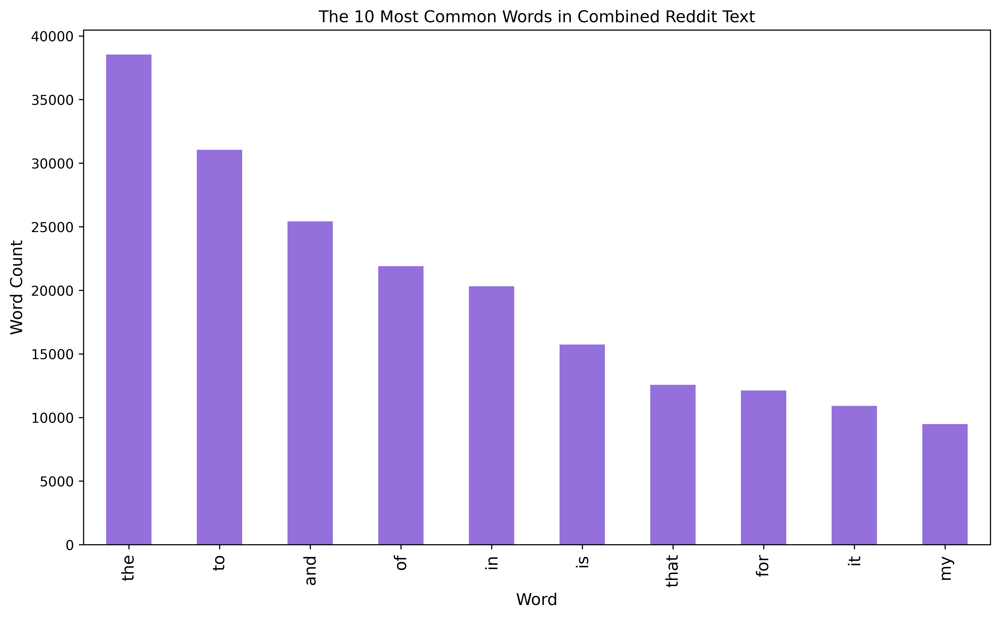

## Reddit NLP on r/biochemistry and r/biology

DSIR-X Polytechnic Institute is one of the leading universities in technical professional development in the world. At DSIR-X, in a short 12 weeks, students will be able to use highly technical skills to solve global challenges -through the sheer magical ability of data and computers! But, no matter how focused students are on software development or data science they are still required to take those pesky science electives, such as general biology or biochemistry! Textbooks are expensive and none of DSIR-X Polytechnic students want to buy a \$350 book for a class they are being forced to take!

So, where are these students going to get their burning biology or biochemistry questions answered? We don't want this high cost of textbooks to negatively impact student's grades or hamper their natural curiosity. You need a place where students can go to get their scientific elective questions answered timely and accurately, depending on the specific subject matter. This will help to improve student grades and clarify and satiate these questions or curiosities. 

#### The Solution
To the benefit of the students, Reddit is a main-stream forum and discussion website where proficient and experienced professionals and other knowledgable individuals will answer questions or discuss subreddit topics. Reddit boasts approximately 2 million subreddits, which span the entire breadth of available knowledge, and allows users to follow and post discussions in forum pages at will. The structure of Reddit allows a user to follow specific forums/subreddits they are interested in and become connected with users of similar interests. I focused on classifying the subreddits for two of the most popular science electives at DSIR-X Polytechnic, general biology and biochemistry. With predictive analytics, through natural language processing and classification algorithms, I generated a binary classification model to help students determine which subreddit, r/biology or r/biochemistry, is the best to post their question in.

#### The Evaluation Metrics
As an individual, I am both an erudite biochemist and data scientist. This fact allowed to me apply domain knowledge to both of these fields to obtain a classifier which performed above the null model in both accuracy and recall in predicitve power. The null model, a starting point to compare the performance of future models to, is one that will predict the most frequently occuring class in the training set. The most frequently occuring class, r/biochemistry, created a null model with 56.8% accuracy.

The final production model was the one which scored the best on a pair of evaluation metrics: accuracy and recall. Accuracy is an important metric for this classifier because the NLP model should be able to, as accurately as possible, predict the correct subreddit a post belongs to. In the cruel land of subreddits a user can become banned from that subreddit just for posting something that is not aligned with that page's identity.

Optimizing recall is also important for the classifier - as we are trying to model towards a successful classification of r/biochemistry- to minimize the number of false negatives (incorrectly classified true r/biochemistry posts). r/biochemistry is a more specialized branch of biology and so it is important that you try to capture these biochemical/molecular-based posts into r/biochemistry, where they truly belong. A higher true positive rate means the students are more likely to get their biochemistry questions answered correctly and timely.

#### Data: Cleaning and EDA
The subreddit data was scraped from Reddit using PushShift's API (https://github.com/pushshift/api). After obtaining the data, it went through cleaning to remove spam-noise, punctutation, and to lowercase all words. There were posts present in the data, which had [removed] or [deleted] text, corresponding to a now deactivated user account of a deleted post. These rows were dropped from the data as they did not hold any text. 

Before I began modeling, I removed variations of the names of the subreddits themselves from the text. Variations of biology and biochemistry, such as bio and biochem were widely present. As I want to classify posts based on scientific terminology alone, I did not want the subreddit names to have strong predictive power on the outcomes of the models. For a numerical representation, of the approximate 4,000 biology posts about 2,000 of them contained a form of the word biology/bio.

The graph below shows the most common words in the combined selftext and title text of the subreddits. As you can see, a majority of the most common words are prepositions - words such as 'to' and 'in'. These prepositional words do not have any significant meaning to predicting whether a post will more likely be in r/biology or r/biochemistry so they were removed from the models as stopwords.

#### Final Production Model
The final production model consisted of the following attributes: CountVectorization with a currated list of stop words and a MultinomialNB classifier. CountVectorization is a bag-of-words transformer, which will create a sparse array of numerical values for each word in the text. The stop words used in the CountVectorizer are words that do not add meaning to the text. These words can be ignored during training of the model. MultinomialNB is a classifier which will compute the probabilities discrete words belong to a certain class. These probablities will be used to classify a body of text using maximum a posteriori.

The final model approximately scored 75% on accuracy and 86% on recall. This model was chosen as the final model, not only because it had the highest pair-wise scores on both accuracy and recall, but because the model did not experience any overfitting. This means it has a better generalizability for future predicting. 

There were clear patterns that became clear once this model was created and analyzed. Below is a visualization of the top 10 most important words for classifying a post as from the r/biochemsitry subreddit. Within these top words you see some biochemistry specific terminology, such as protein, but also a lot of non-scientific words. This corresponds to the fact that the r/biochemistry subreddit is not heavily modded to just scientific-based questions and many posts are students seeking advice on careers or university choice.

Below is another visualization, this time 10 least important words for classifying a post as being from the r/biochemistry subreddit. Conversely, another way to think about this is that these words are important in determining that a post is actually from the r/biology subreddit instead. Within the words shown in the graph, there are several biology specific terms, such as 40x and the two variations of adaptation. 40x refers to the objective magnification of a microscope. Adaptation refers to a change that allows an organism to become better suited to its environment. There are about 200 other words which scored the same coefficient as the ones listed below. Within this list of ~200 words many were biology specific, a few examples are the words meiosis, gametes, oocyte, fitness, niche, phylogenetic tree and more.

#### The Conclusion
My endeavour to create a classifier which performed above the null model was successful. The final model was classifying posts based on specific scientific terminology. This terminology is the same as what a DSIR-X Polytechnic student would use if they wanted to post a question about concepts from their textbookless science elective. A DSIR-X Polytechnic student who asks 'Can someone explain amino acid absorption competition?' will have their question correctly predicted and referred to be posted to the r/biochemistry subreddit.

#### Improvement
There is potential to create a strong predictive model based on scientific terms. As we saw above, there is predictive separation of terminology within the final classifier, but the model requires work.

Mid-creation of the models I ended up pulling more data, and found a sizable increase in accuracy and recall score. This is due to the high amount of noise, unspecific posts asking for future career advice or which univeristy to attend, within the subreddits. In order to refine the model, creating a stronger predictor based on difference in scientific terms, more data needs to be scraped from each of the subreddits. This will allow for a wider breadth of scientific terminology to be present within the posts, which will allow for better prediction on unknown text. 